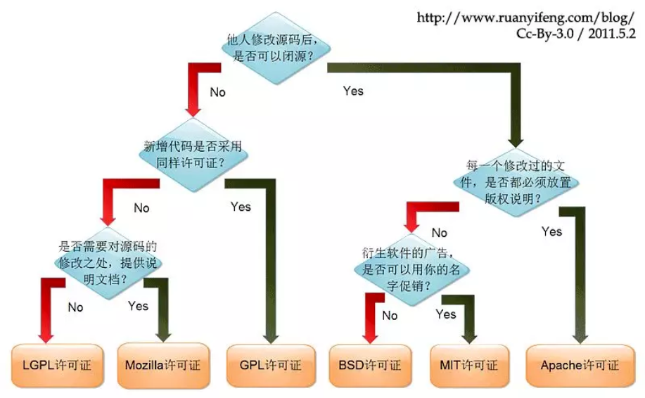
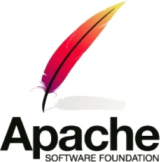

# 开源协议Open Source License

## 1.开源协议的作用

开源协议规定了你在使用开源软件时的权利和责任, 也就是规定了你可以做什么, 不可以做什么.

开源协议虽然不一定具备法律效力, 但当涉及软件版权纠纷时, 开源协议也是非常重要的证据之一.

也就是说你把你的软件开源出去了, 但是你想对使用你的开源软件的人的行为有一定约束, 不是说他拿着你的软件想干啥就干啥的.

## 2.常见的开源协议

### GPL

GPL即GNU General Public License, GNU通用公共许可证.

只要软件中包含了遵循GPL协议的产品或代码, 该软件就必须也遵循GPL许可协议, 也就是必须开源免费, 不能闭源收费, 因此这个协议并不适合商用软件.

害它就是属于GNU组织的嘛, 这就是个纯粹开源组织, 人家干的就是开源共享, 就不让你商用.

遵循GPL协议的开源软件数量及其庞大, 包括Linux系统在内的大多数开源软件都是基于这个协议的.

### BSD

BSD即Berkeley Software Distribution, 伯克利软件发布版的协议.

BSD协议给予用户极大的权利, 用户可以使用, 修改和重新发布遵循该许可的软件, 并且可以将软件作为商业软件发布和销售, 前提是需要满足下面3个条件:

- 如果再发布的软件中包含源代码, 则源代码必须继续遵循BSD许可协议.
- 如果再发布的软件中只有二进制程序, 则需要在相关文档或版权文件中声明原始代码遵循了BSD协议.
- 不允许用原始软件的名字, 作者名字或机构名称等进行市场推广.

BSD协议对商业比较友好, 很多公司在选用开源产品的时候都首选BSD协议, 因为可以完全控制这些第三方的代码, 甚至在必要的时候可以修改或者二次发布.

### MIT

MIT即Massachusetts Institute of Technology协议.

目前限制最少的开源许可协议之一, 只要程序的开发者在修改后的源代码中保留原作者的许可信息即可, 因此普遍被商业软件所使用.

### Apache

Apache协议在为开发人员提供版权及专利许可的同时, 允许用户修改代码及再发布.

程序开发人员在开发遵循该协议的软件时, 要严格遵守下面的4个条件:

- 该软件及其衍生品必须继续使用Apache许可协议.
- 如果修改了程序源代码, 需要在文档中进行声明.
- 若软件是基于他人的源代码编写而成的, 则需要保留原始代码的协议, 商标, 专利声明及其他原作者声明的内容信息.
- 如果再发布的软件中有声明文件, 则需在此文件中标注Apache许可协议及其他许可协议.

另外, Apache协议规定, 使用者一旦被授权, 永久拥有. 

授权免费, 且无版税; 前期, 后期均无任何费用.

授权无排他性, 任何人都可以获得授权.

授权不可撤销, 一旦获得授权, 没有任何人可以取消. 比如, 你基于该产品代码开发了衍生产品, 你不用担心会在某一天被禁止使用该代码.

### LGPL

LGPL即GNU Lesser General Public License, GNU宽通用公共许可证. LGPL是GPL的一个衍生版本, 也被称为GPL v2, 该协议主要是为类库设计的开源协议.

LGPL允许商业软件通过类库引用(link)的方式使用LGPL类库, 而不需要开源商业软件的代码. 这使得采用LGPL协议的开源代码可以被商业软件作为类库引用并发布和销售.

但是如果修改LGPL协议的代码或者衍生品, 则所有修改的代码, 设计修改部分的额外代码和衍生的代码都必须采用LGPL协议.

因此LGPL协议的开源代码很适合作为第三方类库被商业软件引用, 但不适合希望以LGPL协议代码为基础, 通过修改和衍生的方式做二次开发的商业软件所采用.